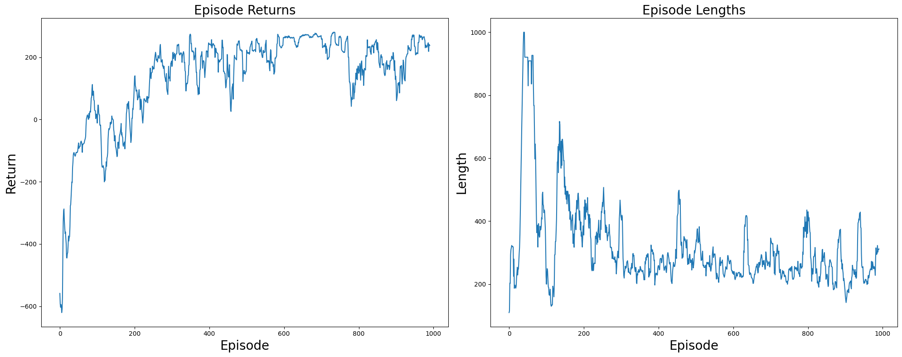

# Lunar Lander with Deep Reinforcement Learning

This project implements a Deep Q-Network (DQN) using PyTorch to train an agent to solve the `LunarLander-v3` environment from OpenAI Gym. The agent learns to land a spacecraft safely by interacting with the environment and approximating value functions through a neural network.

Key reinforcement learning techniques used include epsilon-greedy exploration, experience replay, and a target network. Over 1000+ training episodes, the agent consistently learned to land successfully.

Through this project, I gained hands-on experience with deep reinforcement learning and a stronger understanding of how neural networks can approximate value functions in sequential decision-making tasks.

---

## Key Components

- **Environment**: OpenAI Gym `LunarLander-v3`
- **Algorithm**: Deep Q-Network (DQN)
- **Techniques**:
  - Epsilon-greedy exploration
  - Experience replay buffer
  - Target network for stabilized Q-value updates

---

## Training Results

- The agent learned to land successfully in most episodes by the end of training.
- Episode returns increased significantly, with landing efficiency improving over time.

  <strong>Training Performance</strong> 
  

- **Left**: Episode Returns — shows increasing reward as the policy improves  
- **Right**: Episode Lengths — shows shorter, more efficient landings
